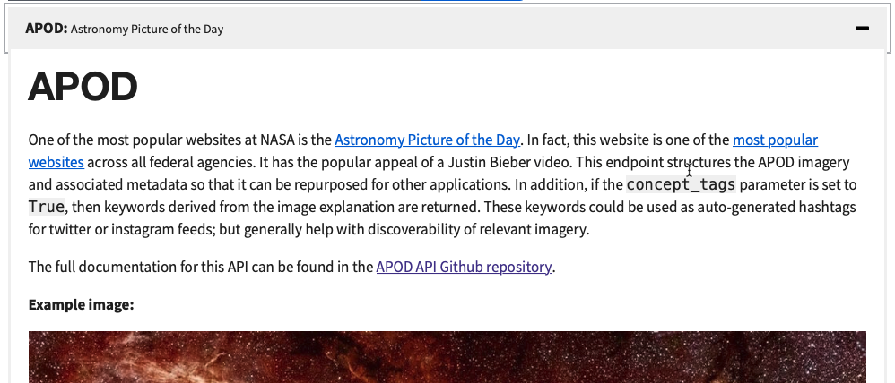
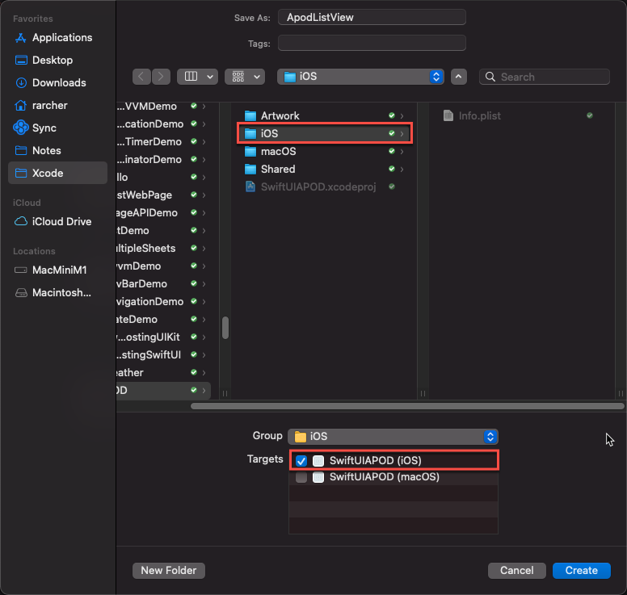

# SwiftUIAPOD

Simple SwiftUI Astronomy Picture of the Day demo app.

# Introduction

This article shows how to create a simple **Astronomy Picture of the Day** (APOD) app in SwiftUI.
The main features are:
- Multi-platform. App runs on (and is optimized for) iOS and macOS
- Data model and other views shared between platforms
- Get JSON data via an HTTP call to a NASA public API
- Parse the JSON to retrieve image metadata
- Display the image and associated text
- App allows the user to chose from:
    - Today's APOD image
    - The APOD image for a particular date
    - A number of randomly selected APOD images

---

# The APOD API

 NASA provides a public API that allows us to request the current APOD, the APOD for a partucular date (or date range) or chose a number of random APOD images.
 
You can view details of the API (and other NASA APIs) here: https://api.nasa.gov/index.html.


First, generate yourself an API key and then locate the APOD API:


You can now view the API documentation:



Note the various parameters you can provide to refine your APOD API request:


Create a test request directly in the browser:


Alternatively, you can use an API client like **PAW** (https://paw.cloud):


# Designing the UI

Here's a first-pass at designing the app's UI. I used Sketch (https://www.sketch.com) to create the design, but even a rough pencil and paper outline is more than sufficient for such a simple UI.

Intially we'll create the UI for iOS:


# Create the Xcode Project

Create a new Xcode SwiftUI project using the **Multiplatform > App** template:


Notice how we have folders for the **iOS** and **macOS** targets, plus a **Shared** folder for code that will be used by both targets:


# Creating the Data Model

If we look at an example of the JSON returned by the APOD API we see the following structure:

```json
{
  "date": "2021-03-24",
  "explanation": "description of image",
  "hdurl": "https://apod.nasa.gov/apod/image/2103/AuroraLightningJupiter_Juno_1629.jpg",
  "media_type": "image",
  "service_version": "v1",
  "title": "Aurorae and Lightning on Jupiter",
  "url": "https://apod.nasa.gov/apod/image/2103/AuroraLightningJupiter_Juno_1080.jpg"
}
```

We can quickly and easily create a Swift data model using the website  https://app.quicktype.io.

Simply copy and paste  sample data into the left pane and the required data model is generated for us:


Copy the generated code, create a new swift file in the **Shared** folder of your Xcode project and then paste the code into it:

```swift
//
//  ApodModel.swift
//  SwiftUIAPOD
//
//  Created by Russell Archer on 24/03/2021.
//

import Foundation

struct ApodModel: Codable {
    let date: String
    let explanation: String
    let hdurl: String
    let mediaType: String
    let serviceVersion: String
    let title: String
    let url: String

    enum CodingKeys: String, CodingKey {
        case date
        case explanation
        case hdurl
        case mediaType = "media_type"
        case serviceVersion = "service_version"
        case title
        case url
    }
}
```

Note that `ApodModel` is `Codable` and thus supports JSON encoding and decoding.

# Creating the Networking Helper

We can now create a network helper to test the API.
Create a new Swift file named `NetworkingHelper` and add the following code:

```swift
//
//  NetworkingHelper.swift
//  SwiftUIAPOD
//
//  Created by Russell Archer on 25/03/2021.
//

import Foundation

struct NetworkingHelper {
    
    /// Requests APOD image data from the NASA APOD API.
    /// Note that if `count` is > 1 the value of `date` is ignored and `count` random APOD images are requested.
    /// - Parameters:
    ///   - date: The date ("YYYY-MM-DD", e.g. "2021-03-24") of the requested image data. Defaults to nil, meaning today's APOD.
    ///   - count: The number of requested images. Defaults to 0, meaning today's APOD.
    ///   - handler: A closure that will be called when the image data becomes available.
    static func requestApodData(date: String? = nil,
                                 count: Int = 1,
                                 handler: @escaping ((Result<[ApodModel]?, NetworkingHelperError>) -> Void)) {
        
        let url = NetworkingHelper.buildQuery(date: date, count: count)
        guard url != nil else {
            print("Can't build query: bad params")
            handler(.failure(.badParams))
            return
        }
        
        let task = URLSession.shared.dataTask(with: url!) { (json, response, error) in
            
            guard json != nil else {
                print("No data returned in server response")
                DispatchQueue.main.async { handler(.failure(.noData)) }
                return
            }
            
            // Check the response from the server (200 == OK)
            let httpResponse = response as! HTTPURLResponse
            guard httpResponse.statusCode == 200 else {
                print("Bad HTTP response status code: \(httpResponse.statusCode)")
                DispatchQueue.main.async { handler(.failure(.badResponse)) }
                return
            }
            
            // JSONEncoder and JSONDecoder allow you to easily encode/decode Codable structs/classes
            if count == 1 {
                let apodData = try? JSONDecoder().decode(ApodModel.self, from: json!)
                DispatchQueue.main.async { handler(.success([apodData!])) }
            } else {
                let apodData = try? decoder.decode([ApodModel].self, from: json!)
                DispatchQueue.main.async { handler(.success(apodData!)) }
            }
        }
        
        task.resume()  // Start the request
    }
    
    private static func buildQuery(date: String?, count: Int) -> URL? {
        // Build the request URL
        // Examples:
        //  * https://api.nasa.gov/planetary/apod?api_key=Q43WCsMxZ9Eb05BXRgcvzmrIXrXgANqKOSjhWYWp
        //  * https://api.nasa.gov/planetary/apod?api_key=Q43WCsMxZ9Eb05BXRgcvzmrIXrXgANqKOSjhWYWp&count=5
        //  * https://api.nasa.gov/planetary/apod?api_key=Q43WCsMxZ9Eb05BXRgcvzmrIXrXgANqKOSjhWYWp&date=2021-01-03
        
        var request = URLComponents()
        request.scheme = "https"
        request.host = "api.nasa.gov"
        request.path = "/planetary/apod"
        request.queryItems = [URLQueryItem(name: "api_key", value: "Q43WCsMxZ9Eb05BXRgcvzmrIXrXgANqKOSjhWYWp")]
        
        if count > 1 {
            request.queryItems!.append(URLQueryItem(name: "count", value: String(count)))
        } else if date != nil {
            request.queryItems!.append(URLQueryItem(name: "date", value: date!))
        }
        
        return request.url
    }
}

enum NetworkingHelperError: Error {
    case noError        // No current error
    case badParams      // Can't make a valid URL using the supplied parameters
    case badResponse    // Server returned an error
    case noData         // No data returned by APOD API
    case cantDecode     // Unable to decode the JSON returned by APOD API
    
    func description() -> String {
        switch self {
            case .noError:      return "No Error"
            case .badParams:    return "Can't make a valid URL using the supplied parameters"
            case .badResponse:  return "Server returned an error"
            case .noData:       return "No data returned by APOD API"
            case .cantDecode:   return "Not Decodable (JSON couldn't be parsed)"
        }
    }
}
```

## How it works
We make a request for APOD data via the `requestApodData(date:count:handler:)` function. 
Its final parameter is a closure that takes a `Result<[ApodModel]?, NetworkingHelperError>`.

The main part of the the `requestApodData(date:count:handler:)` function is the use of `URLSession` to make the asynchronous request to the APOD API. 
When the request completes we use a closure to either handler errors or parse the JSON returned into an `ApodModel` struct. 

Note that because it's an async operation the closure will be called on a thread other than the main thread. 
If we were to try and update the UI immediately our app would crash, because updates to the UI must take place of the main thread. 
So, we use `DispatchQueue.main.async {...}` when passing `ApodModel` back to our caller:

```swift
let task = URLSession.shared.dataTask(with: url!) { (json, response, error) in

    :
    let apodData = try? JSONDecoder().decode(ApodModel.self, from: json!)
    DispatchQueue.main.async { handler(.success([apodData!])) }
    :
}

task.resume()  // Start the request
```

## Testing the network helper

To test the networking helper add the following to the **shared** `ContentView`:

```swift
//
//  ContentView.swift
//  Shared
//
//  Created by Russell Archer on 24/03/2021.
//

import SwiftUI

struct ContentView: View {
    
    var body: some View {
        Button("Get Data") {
            NetworkingHelper.requestApodData(date: nil, count: 5) { result in
                switch result {
                    case .failure(let error): print("Error: \(error.description())")
                    case .success(let data):
                        data!.forEach { apod in
                            print(apod.title)
                        }
                }
            }
        }
    }
}
```

# Creating the iOS UI




# TODO

- Complete macOS app
